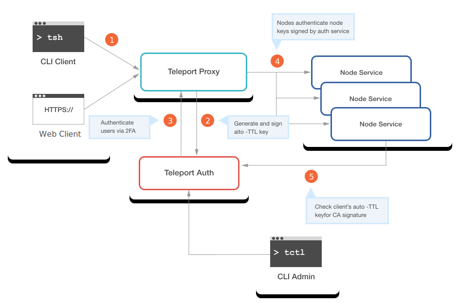

## Architecture Introduction

This is a conceptual guide for those looking for a deeper understanding of Teleport. If you are looking for hands-on instructions on how to set up Teleport for your team, check out the [Production Guide](../guides/production)

[TOC]

## Design Principles

Teleport was designed in accordance with the following principles:

* **Off the Shelf Security**: Teleport does not re-implement any security primitives and uses well-established, popular implementations of the encryption and network protocols.

* **Open Standards**: There is no security through obscurity. Teleport is fully compatible with existing and open standards and other software, including [OpenSSH](../guides/openssh).

* **Cluster-Oriented Design**: Teleport is built for managing clusters, not individual servers. In practice this means that hosts and [Users](./users) have cluster memberships. Identity management and authorization happen on a cluster level.

* **Built for Teams**: Teleport was created under the assumption of multiple teams operating on several disconnected clusters. Example use cases might be production-vs-staging environment, or a cluster-per-customer or cluster-per-application basis.

## Architecture Walkthrough

Here is a detailed diagram of a Teleport Cluster. 

The numbers correspond to the steps needed to connect a client to a node. These steps are explained in detail below the diagram.

!!! note "Caution"
    The Teleport Admin tool, `tctl`, must be physically present on the same machine where Teleport Auth is running. Adding new nodes or inviting new users to the cluster is only possible using this tool.

### 1: Initiate Client Connection

<!--TODO Diagram-->

The client tries to establish an SSH connection to a proxy using the CLI interface or a web browser. When establishing a connection, the client offers its public key. Clients must always connect through a proxy for two reasons:

1. Individual nodes may not always be reachable from outside a secure network.
2. Proxies always record SSH sessions and keep track of active user sessions. This makes it possible for an SSH user to see if someone else is connected to a node she is about to work on.

### 2: Sign Client Certificate

<!--TODO Diagram-->

The proxy checks if the submitted certificate has been previously signed by the auth server.

If there was no key previously offered (first time login) or if the certificate has expired, the proxy denies the connection and asks the client to login interactively using a password and a 2nd factor if enabled.

Teleport uses [Google Authenticator](https://support.google.com/accounts/answer/1066447?hl=en), [Authy](https://www.authy.com/), or another [TOTP](https://en.wikipedia.org/wiki/Time-based_One-time_Password_algorithm) generator. The password + 2nd factor are submitted to a proxy via HTTPS, therefore it is critical for a secure configuration of Teleport to install a proper HTTPS certificate on a proxy.

!!! warning "Warning":
	Do not use a self-signed SSL/HTTPS certificates when creating production! 

If the credentials are correct, the auth server generates and signs a new certificate and returns
it to a client via the proxy. The client stores this key and will use it for subsequent
logins. The key will automatically expire after 12 hours by default. This TTL can be [configured](../configuration#certificates) to another value by the cluster administrator.

### 3: Authenticate Client Certificate

<!--TODO Diagram-->

At this step, the proxy tries to locate the requested node in a cluster. There are three lookup mechanisms a proxy uses to find the node's IP address:

1. Use DNS to resolve the name requested by the client.
2. Asks the Auth Server if there is a Node registered with this `nodename`.
3. Asks the Auth Server to find a node (or nodes) with a label that matches the requested name.

If the node is located, the proxy establishes the connection between the client and the requested node. The destination node then begins recording the session, sending the session history to the auth server to be stored.

!!! note "Note":
    Teleport may also be configured to have the session recording occur on the proxy, see [Session Recording](../guides/session-recording) for more information.

### 4: Authenticate Node Certificate

<!--TODO Diagram-->

When the node receives a connection request, it checks with the Auth Server to validate the node's public key certificate and validate the Node's cluster membership.

<!--TODO: Expand if needed-->

### 5: Grant User Node Access

<!--TODO Diagram-->

The node requests the Auth Server to provide a list of [OS users (user mappings)](../concepts/users) for the connecting client, to make sure the client is authorized to use the requested OS login.

Finally the client is authorized to create an SSH connection to a node. 

<!--TODO: Expand if needed-->

## More Concepts

* [Basics](./basics)
* [Users](./users)
* [Nodes](./nodes)
* [Authentication](./authentication)
* [Proxy](./proxy)
