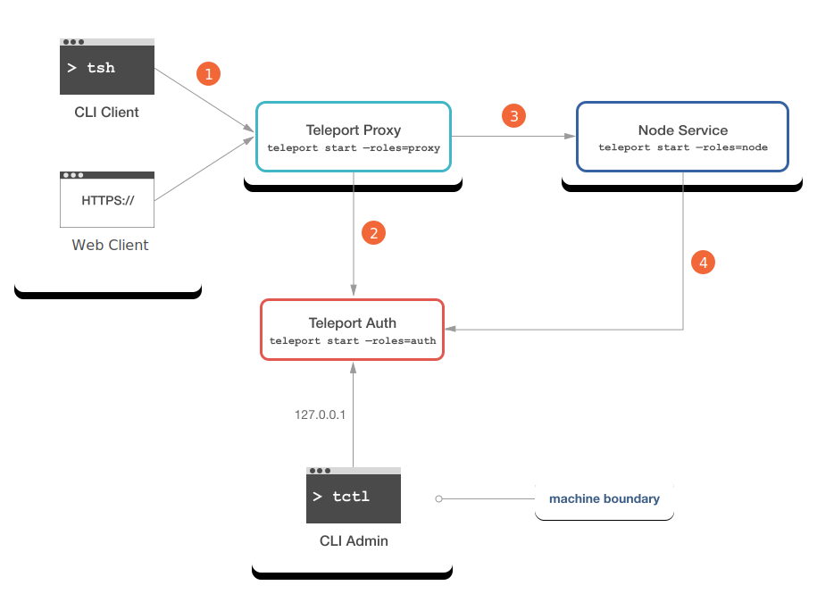

## Introduction

This doc introduces the basic concepts of Teleport so you can get started managing access!

[TOC]

## Concepts

Here are definitions of the key concepts you will use in teleport.

|Concept                  | Description
|------------------|------------
| Node             | A node is a "server", "host" or "computer". Users can create shell sessions to access nodes remotely. 
| User             | A user represents someone (a person) or something (a machine) who can perform a set of operations on a node.
| Cluster          | A cluster is a group of nodes that work together and can be considered a single system. Cluster nodes can create connections to each other, often over a private network. Cluster nodes often require TLS authentication to ensure that communication between nodes remains secure and comes from a trusted source. 
| Certificate Authority (CA) | A Certificate Authority issues SSL certificates in the form of public/private keypairs. 
| [Teleport Node](./nodes)    | A Teleport Node is a regular node that is running the Teleport Node service. Teleport Nodes can be accessed by authorized Teleport Users. A Teleport Node is always considered a member of a Teleport Cluster, even if it's a single-node cluster.
| [Teleport User](./users)    | A Teleport User represents a someone who needs access to a Teleport Cluster. Users have stored usernames and passwords, and are mapped to OS users on each node. User data is stored locally or in an external store.
| [Teleport Cluster](./nodes/#clusters) | A Teleport Cluster is comprised of one or more nodes, each of which hold public keys signed by the same [Auth Server CA](./auth). The CA cryptographically signs the public key of a node, establishing cluster membership.
| [Teleport CA](./authentication) | Teleport operates two internal CAs as a function of the Auth service. One is used to sign [User](./users) public keys and the other signs [Node](./nodes) public keys. Each certificate is used to prove identity, cluster membership and manage access. 

## Architecture Overview

The numbers correspond to the steps needed to connect a client to a node. These steps are explained below the diagram. Read the [Architecture Walkthrough](./architecture/#architecture-walkthrough) for a detailed view into these connections steps.

!!! warning "Caution"
    The teleport daemon calls services "roles" in the CLI client. The `--roles` flag has no relationship to concept of User Roles or permissions.

1. Initiate Client Connection
2. Authenticate Client
3. Connect to Node
4. Authorize Client Access to Node

## Teleport Services

Teleport uses three services which work together: [Nodes](./nodes), [Auth](./authentication), and [Proxy](./proxy).

* [**Teleport Nodes**](./nodes) are servers which can be accessed remotely with SSH. The Teleport Node service runs on a machine and is similar to the `sshd` daemon you may be familiar with. Users can log in to a Teleport Node with all of the following clients:
    * [OpenSSH: `ssh`](../guides/openssh)
    * [Teleport CLI client: `tsh ssh`](../cli-docs/#tsh-ssh)
    * A web browser & [Teleport Proxy UI](./proxy/#web-to-ssh-proxy)
* [**Teleport Auth**](./authentication) authenticates Users and Nodes, authorizes User access to Nodes, and acts as a CA by signing certificates issued to Users and Nodes.
* [**Teleport Proxy**](./proxy) forwards User credentials to the [Auth Service](../authentication), creates connections to a requested Node after successful authentication, and serves a [Web UI](../proxy/#web-to-ssh-proxy).

## Next Steps

* If you haven't already, read the [Quickstart Guide](./guides/quickstart) to try Teleport in action
* Set up Teleport for your team with the [Production Guide](./guides/production)
* Read more about Teleport
    * [Teleport Nodes](./nodes)
    * [Teleport Users](./users)
    * [Teleport Auth](./authentication)
    * [Teleport Proxy](./proxy)
    * [Architecture & Design](./architecture)
