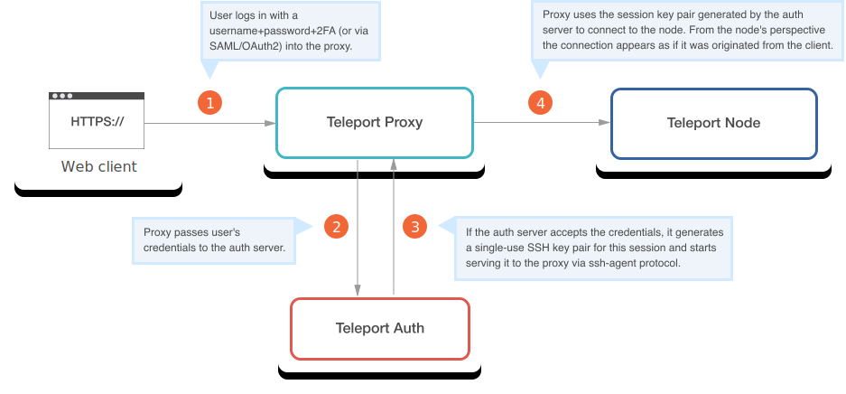
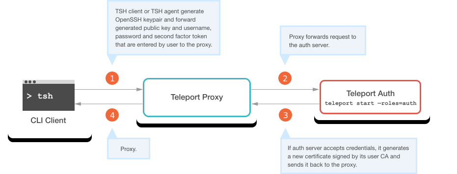
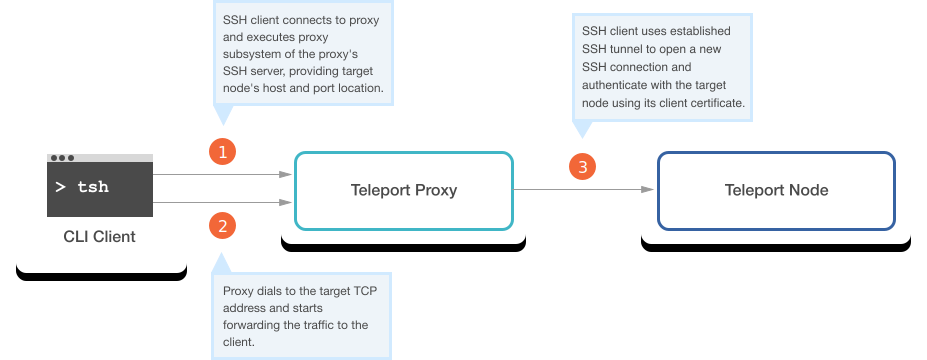

## The Proxy Service

TODO: This doc is in-progress not at reviewable stage
<!--TODO: Diagram-->

The proxy is a stateless service which performs two functions in a Teleport cluster:

1. It serves a Web UI which is used by cluster users to sign up and configure their accounts,
   explore nodes in a cluster, log into remote nodes, join existing SSH sessions or replay
   recorded sessions.

2. It serves as an authentication gateway, asking for user credentials and forwarding them
   to the auth server via Auth API. When a user executes [`tsh --proxy=p ssh saturn`](../cli-docs/#tsh-ssh) command, trying to log into the Node "saturn", the [`tsh`](../cli-docs/#tsh) tool will establish HTTPS connection to the proxy "p" and authenticate before it will be given access to "saturn".

All user interactions with the Teleport cluster are done though a proxy service. It is
recommended to have several of them running in [production](../guides/production).

When you launch the Teleport Proxy for the first time, it will generate a self-signed HTTPS
certificate to make it easier to explore Teleport.

<!--TODO: Link to other parts of the docs-->

!!! warning "Use HTTPS in Production":
	It is absolutely crucial to properly configure TLS for HTTPS when you use Teleport Proxy in production.

### Web to SSH Proxy

In this mode, Teleport Proxy implements WSS - secure web sockets - to SSH proxy:

1. User logs in to Proxy Server using username, password and 2nd factor token.
2. Proxy passes credentials to the Auth Server's API
3. If Auth Server accepts credentials, it generates a new web session and generates a special
   ssh keypair associated with this web session. Auth server starts serving [OpenSSH ssh-agent protocol](https://github.com/openssh/openssh-portable/blob/master/PROTOCOL.agent)
   to the proxy.
4. From the SSH node's perspective, it's a regular SSH client connection that is authenticated using an OpenSSH certificate, so no special logic is needed.

!!! note "NOTE":
    When using the web UI, the Teleport Proxy terminates SSL traffic and re-encodes data for the SSH client connection.

#### CLI to SSH Proxy

<!--TODO: Diagram-->

**Getting signed short-lived certificates**

Teleport Proxy implements a special method to let clients get short lived certificates signed by auth's host certificate authority:

1. [`tsh` client/agent](../cli-docs/#tsh) generates OpenSSH keypair and forward generated public key and username, password and second factor token that are entered by user to the proxy.
2. Proxy forwards request to the auth server.
3. If auth server accepts credentials, it generates a new certificate signed by its user CA and sends it back to the proxy.
4. Proxy returns the user certificate to the client and client stores it in `~/.tsh/keys`

**Connecting to the nodes**

Once the client has obtained a short lived certificate, it can use it to authenticate with any node in the cluster. Users can use the certificate using standard OpenSSH client (and get it using ssh-agent socket served by `tsh agent`) or using `tsh` directly:

1. SSH client connects to proxy and executes `proxy` subsystem of the proxy's SSH server, providing target node's host and port location.
2. Proxy dials to the target TCP address and starts forwarding the traffic to the client.
3. SSH client uses established SSH tunnel to open a new SSH connection and authenticate with the target node using its client certificate.

!!! tip "NOTE":
    Teleport's proxy command makes it compatible with [SSH jump hosts](https://wiki.gentoo.org/wiki/SSH_jump_host) implemented using OpenSSH's `ProxyCommand`s